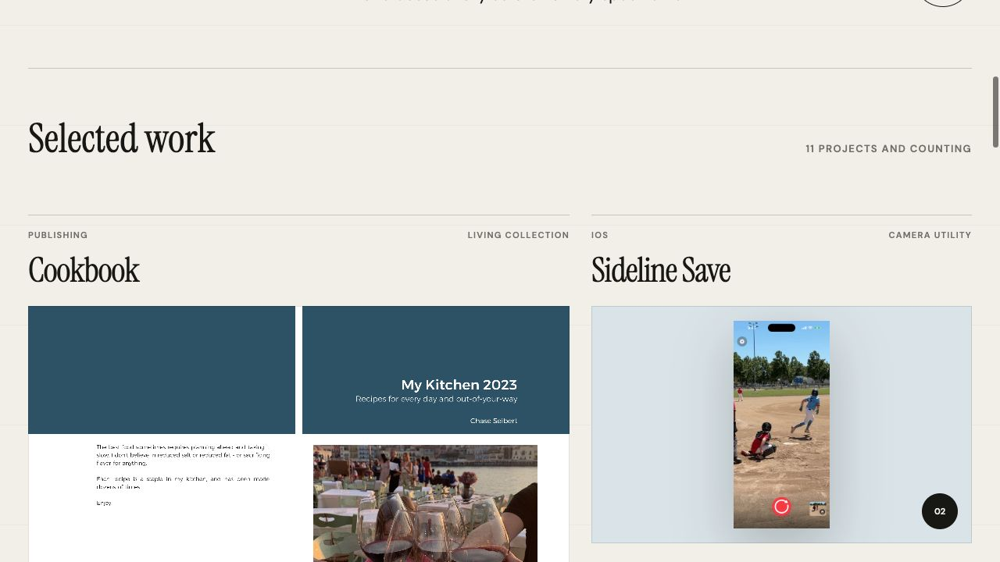

# Built by Chase

A static portfolio of apps, tools, and experiments built by Chase Seibert.



## Local preview

```sh
make setup
make run
```

The development server prints the local preview URL. For a production-like preview, run `make build` followed by `make preview`.

## Publishing

Pushes to `main` automatically build and deploy the site through GitHub Pages. See [docs/setup-install.md](docs/setup-install.md) for the one-time repository settings and publishing details.

## Updating the gallery

Project content lives in `src/main.tsx`. Add screenshots to `public/apps/`, then update the project list and run `make test`.
